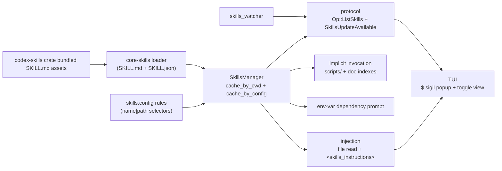
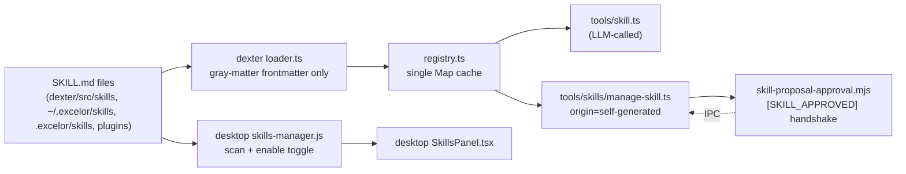

# Skills Parity With Codex

> Actionable, phased plan for bringing Excelor's skills logic (dexter + desktop) up to the shape of codex's skills stack (`codex-rs/skills` + `codex-rs/core-skills` + protocol + tui).
>
> Codex sources live under `codes/codex/codex-rs/**`. Excelor sources live under `cowork - Copy/**`.

---

## 1. Executive summary

Excelor already has a working end-to-end "skill" concept: a SKILL.md file with YAML frontmatter, a process-wide registry, a tool the LLM can call, and a desktop UI with a self-improvement / approval loop. Codex ships a substantially more complete system: a richer metadata model (interface, dependencies, policy, scope), bundled "system" skills that install into the user's codex home, config-driven enable/disable rules, a per-cwd + per-config cache, `$`-sigil mentions, mention-driven injection (vs a model-called tool), implicit invocation from shell commands, per-turn env-var dependency prompting, a filesystem watcher, product gating, and a standardized list/update protocol.

The Excelor `manage_skill` self-generation flow plus the desktop `[SKILL_APPROVED]` handshake has no analogue in codex and is kept as Excelor-exclusive.

Parity status at a glance:

| Area | Codex | Excelor today | Status |
|---|---|---|---|
| Data model (interface, dependencies, policy, scope) | Full | name / description / source / origin only | Gap |
| Scope system | User / Repo / System / Admin | builtin / user / project / plugin | Gap (rename + semantics) |
| Bundled / system skills | `include_dir!` + marker fingerprint | None | Gap |
| Frontmatter + sidecar | SKILL.md YAML + optional SKILL.json | SKILL.md YAML only | Gap |
| Config-driven enable rules | Layered `skills.config[]` + `bundled.enabled` | `EXCELOR_SKILLS_MODE` env var only | Gap |
| Caching | Dual `cache_by_cwd` + `cache_by_config` | Single process-wide Map | Gap |
| Explicit mentions | `$skill` sigil + `[name](path)` linked | None (LLM calls `skill` tool) | Gap |
| Injection | File-read via sandbox FS + `<skills_instructions>` wrap + warnings + analytics | Tool return string | Gap |
| Implicit invocation | `scripts/` + doc-path indexes + shell-cmd detection | None | Gap |
| Env-var dependencies | Per-turn `request_user_input` prompt, session-scoped secret storage | None | Gap |
| Product gating | `Product::Codex` restriction | None | Gap |
| Watcher | `skills_watcher.rs` emits `SkillsUpdateAvailable` | None | Gap |
| Protocol surface | `Op::ListSkills`, `SkillsListEntry`, granular `skill_approval` | Ad hoc IPC | Gap |
| System-prompt doctrine | Progressive-disclosure block in `<skills_instructions>` | Short `## Available Skills` + brief policy | Gap |
| UX | `$` popup + toggle view in TUI | Desktop `SkillsPanel` | Different form factor, needs mention surface |
| Self-generation (`manage_skill`, `[SKILL_APPROVED]`) | None | Full | Excelor-exclusive (keep) |

---

## 2. Architecture at a glance

### Codex target shape

### Excelor shape today

The gap between the two is most of the right-hand column of the codex diagram: bundling, config rules, mention-driven injection, implicit invocation, env-dep prompting, watcher, and the list protocol.

---

## 3. Gap inventory

Each subsection follows the same template:

- **Codex**: what exists, cited with file + key lines.
- **Excelor**: what exists today (or doesn't).
- **Gap**: the functional delta.
- **Change**: the concrete work Excelor needs to do.

### 3.1 Data model (SkillMetadata)

- **Codex**: [codes/codex/codex-rs/core-skills/src/model.rs](codes/codex/codex-rs/core-skills/src/model.rs) defines `SkillMetadata { name, description, short_description, interface, dependencies, policy, path_to_skills_md, scope }`, plus `SkillInterface { display_name, short_description, icon_small, icon_large, brand_color, default_prompt }`, `SkillDependencies { tools: Vec<SkillToolDependency> }`, `SkillPolicy { allow_implicit_invocation, products }`. Wire format mirrored in [codes/codex/codex-rs/protocol/src/protocol.rs](codes/codex/codex-rs/protocol/src/protocol.rs) (around `SkillMetadata`/`SkillInterface`/`SkillScope` at ~3367–3445).
- **Excelor**: [cowork - Copy/dexter/src/skills/types.ts](cowork - Copy/dexter/src/skills/types.ts) has only `{ name, description, path, source, origin? }`. Desktop [cowork - Copy/desktop/src/types/skills.ts](cowork - Copy/desktop/src/types/skills.ts) adds `{ command, isEnabled, isVerified, isHidden, filePath, updatedAt }` but none of the codex interface / dependencies / policy fields.
- **Gap**: No `short_description`, `interface`, `dependencies`, `policy`, `scope` on the metadata. No way to carry brand color, display name, default prompt, icons, or tool/MCP dependencies.
- **Change**: Extend `SkillMetadata` / `Skill` in [cowork - Copy/dexter/src/skills/types.ts](cowork - Copy/dexter/src/skills/types.ts) with the codex shape (keeping current fields for backward compatibility). Mirror in [cowork - Copy/desktop/src/types/skills.ts](cowork - Copy/desktop/src/types/skills.ts) so IPC payloads line up. Use `SkillScope` (`'user' | 'repo' | 'system' | 'admin'`) as the canonical scope.

### 3.2 Scope system

- **Codex**: `SkillScope::{User, Repo, System, Admin}` ([protocol.rs](codes/codex/codex-rs/protocol/src/protocol.rs) around 3367). Roots are resolved per-layer in [codes/codex/codex-rs/core-skills/src/loader.rs](codes/codex/codex-rs/core-skills/src/loader.rs). Bundled skills are ranked as System in the `ConfigSkillsCacheKey` (see [manager.rs:276–282](codes/codex/codex-rs/core-skills/src/manager.rs)).
- **Excelor**: `SkillSource = 'builtin' | 'user' | 'project' | 'plugin'` ([dexter/src/skills/types.ts](cowork - Copy/dexter/src/skills/types.ts)). Desktop uses `'official' | 'community' | 'custom'` ([desktop/src/types/skills.ts](cowork - Copy/desktop/src/types/skills.ts)). The two vocabularies do not match each other, let alone codex.
- **Gap**: No `repo` vs `user` distinction (both map to arbitrary `project` / `custom`), no `admin` scope, no ordering semantics tied to the codex `ConfigLayerStack`.
- **Change**: Normalize on `SkillScope = 'user' | 'repo' | 'system' | 'admin'` in both dexter and desktop, with a translation shim from legacy `builtin` → `system`, `project` → `repo`, `plugin` → preserved as a separate `pluginName` field but scoped to `repo` for precedence, `official`/`community`/`custom` mapped to scope via path origin.

### 3.3 Bundled / system skills

- **Codex**: [codes/codex/codex-rs/skills/src/lib.rs](codes/codex/codex-rs/skills/src/lib.rs) bundles `src/assets/samples/` with `include_dir!`, installs into `CODEX_HOME/skills/.system`, writes `.codex-system-skills.marker` with a hash fingerprint (salted `v1`) so reinstall only happens when contents change. Sample skills: `imagegen`, `openai-docs`, `plugin-creator`, `skill-creator`, `skill-installer`. Install/uninstall hooks sit in [codes/codex/codex-rs/core-skills/src/system.rs](codes/codex/codex-rs/core-skills/src/system.rs) and fire from `SkillsManager::new_with_restriction_product` in [manager.rs](codes/codex/codex-rs/core-skills/src/manager.rs).
- **Excelor**: None. `dexter/src/skills` only ships two real skill directories (`dcf`, `x-research`), and they are read directly from the source tree — there is no concept of "install system skills into ~/.excelor/skills/.system".
- **Gap**: No binary-embedded system skills, no fingerprint marker, no install/uninstall semantics, no `bundled.enabled` toggle.
- **Change**:
  - Ship bundled skills under `dexter/src/skills/.system/` (or a new `dexter/assets/skills/`).
  - On dexter startup, copy them into `~/.excelor/skills/.system/` and write `~/.excelor/skills/.system/.excelor-system-skills.marker` containing a hash of the bundled tree.
  - On subsequent startups, skip the copy when the marker matches (parallel to `install_system_skills` in codex).
  - Provide a `skills.bundled.enabled` toggle (mirrors codex). When disabled, remove `.system/` best-effort (parallel to `uninstall_system_skills`).
  - Consider seeding with an Excelor-shaped `skill-creator` sample derived from [codes/codex/codex-rs/skills/src/assets/samples/skill-creator/SKILL.md](codes/codex/codex-rs/skills/src/assets/samples/skill-creator/SKILL.md).

### 3.4 Frontmatter + sidecar (SKILL.md + SKILL.json)

- **Codex**: [codes/codex/codex-rs/core-skills/src/loader.rs](codes/codex/codex-rs/core-skills/src/loader.rs) parses `SKILL.md` YAML (`name`, `description`, `metadata.short-description`) **and** a sibling `SKILL.json` with `{ interface, dependencies, policy }`. Errors on individual skills are captured in `SkillLoadOutcome.errors` without failing the load.
- **Excelor**: [cowork - Copy/dexter/src/skills/loader.ts](cowork - Copy/dexter/src/skills/loader.ts) only reads `name`, `description`, and `origin` from the YAML. Missing fields silently drop the skill. Desktop [cowork - Copy/desktop/lib/skills-manager.js](cowork - Copy/desktop/lib/skills-manager.js) additionally reads `command`, `verified`, `hidden`, `argument-hint`, but still no sidecar.
- **Gap**: No sidecar, no interface/dependencies/policy, no structured error surfacing.
- **Change**:
  - Extend `parseSkillFile` / `extractSkillMetadata` in [cowork - Copy/dexter/src/skills/loader.ts](cowork - Copy/dexter/src/skills/loader.ts) to also read `metadata.short-description` and a sibling `SKILL.json` if present, populating `interface`, `dependencies`, `policy`.
  - Return a `SkillLoadOutcome` object from the registry (skills + per-path errors + disabled paths) so the desktop can render validation problems.

### 3.5 Config-driven enable rules

- **Codex**: [codes/codex/codex-rs/config/src/skills_config.rs](codes/codex/codex-rs/config/src/skills_config.rs) defines `SkillsConfig { bundled, config: Vec<SkillConfig> }` with per-entry `path | name` selector + `enabled`. [codes/codex/codex-rs/core-skills/src/config_rules.rs](codes/codex/codex-rs/core-skills/src/config_rules.rs) resolves the effective disabled set against the loaded skills by walking `ConfigLayerStack` (User + SessionFlags layers, later overriding earlier).
- **Excelor**: Dexter filters by two env vars only (see [registry.ts:70–96](cowork - Copy/dexter/src/skills/registry.ts)): `EXCELOR_SKILLS_MODE=enabled-only` + `EXCELOR_ENABLED_SKILLS=<JSON or CSV of names>`. Desktop toggles `runtimeConfigStore.setSkillEnabled(skillId, enabled)` but that state is not read by dexter.
- **Gap**: No structured `skills.config[]`, no path-vs-name selector, no layered override, no `bundled.enabled`, and desktop toggles are invisible to dexter.
- **Change**:
  - Add a `skills` section to `.excelor/settings.json` (and to `~/.excelor/settings.json`) with the same shape as codex's `SkillsConfig`.
  - Implement a TS equivalent of `resolve_disabled_skill_paths` that walks settings layers (user → project → session flags) and returns the disabled-paths set.
  - Replace the env-var path in `registry.ts` with the layered-rules path; keep env vars working only as an emergency override.
  - Wire `runtimeConfigStore.setSkillEnabled` to write into this same settings shape so the desktop toggle drives dexter.

### 3.6 Caching

- **Codex**: [codes/codex/codex-rs/core-skills/src/manager.rs](codes/codex/codex-rs/core-skills/src/manager.rs) has two `RwLock<HashMap>`s: `cache_by_cwd` (fast path when FS is available) and `cache_by_config` (keyed on `(roots, skill_config_rules)`), with `force_reload` and `clear_cache`. Implicit-invocation indexes are rebuilt in `finalize_skill_outcome`.
- **Excelor**: [cowork - Copy/dexter/src/skills/registry.ts:67–68](cowork - Copy/dexter/src/skills/registry.ts) has a single process-wide `skillMetadataCache: Map<string, SkillMetadata>` + a string `skillCacheSignature` based only on `EXCELOR_ENABLED_SKILLS`. `clearSkillCache()` is exported and called from `manage_skill`.
- **Gap**: No cwd dimension, no config-rules dimension, no force-reload parameter, and no implicit-invocation indexes.
- **Change**: Introduce a `SkillsManager` class (new file `cowork - Copy/dexter/src/skills/manager.ts`) that owns two caches keyed by `(cwd)` and `(rootsHash, rulesHash)`. `discoverSkills` and `getSkill` become thin wrappers that delegate. Expose `skillsForCwd(cwd, { forceReload })` and `clearCache()`.

### 3.7 Explicit mentions (`$` sigil + linked paths)

- **Codex**: `TOOL_MENTION_SIGIL = '$'` ([codes/codex/codex-rs/utils/plugins/src/mention_syntax.rs:4](codes/codex/codex-rs/utils/plugins/src/mention_syntax.rs)). The composer recognises both plain `$skillName` and linked `[display]($name)(path)` forms, deduplicates by path, and excludes common env-var names (`PATH`, `HOME`, …). See [codes/codex/codex-rs/tui/src/chatwidget/skills.rs](codes/codex/codex-rs/tui/src/chatwidget/skills.rs) (`collect_tool_mentions`, `find_skill_mentions_with_tool_mentions`, `parse_linked_tool_mention`, `is_common_env_var`).
- **Excelor**: No in-composer skill mention. The LLM is expected to call the `skill` tool ([cowork - Copy/dexter/src/tools/skill.ts](cowork - Copy/dexter/src/tools/skill.ts)) on its own.
- **Gap**: User cannot pin skills for a turn via a mention. No path-based dedupe. No guardrails against treating an env-var-like token as a skill.
- **Change**: Add a composer-side mention surface in the desktop app (`$name` + `[name](path)` linked form), produce a normalized `MentionedSkills[]` list for each user turn, and deduplicate by `path`. Mirror the common-env-var filter list from codex verbatim.

### 3.8 Injection

- **Codex**: [codes/codex/codex-rs/core-skills/src/injection.rs](codes/codex/codex-rs/core-skills/src/injection.rs) reads each mentioned skill's contents via `ExecutorFileSystem::read_file_text` (respects sandboxing), wraps them with `<skills_instructions>` open/close tags defined in [codes/codex/codex-rs/protocol/src/protocol.rs:96–97](codes/codex/codex-rs/protocol/src/protocol.rs), pushes `ResponseItem` payloads, collects `warnings` for read failures, emits OTel counter `codex.skill.injected` and `AnalyticsEventsClient::track_skill_invocations`.
- **Excelor**: `skill` tool returns a plain string `## Skill: <name>\n\n<rewritten markdown>`. No `<skills_instructions>` wrap. No analytics. No warnings on read failure (tool returns an `Error:` string instead).
- **Gap**: Skill payloads are not distinguishable from normal tool output to the model; no telemetry; failure mode is a string instead of a structured warning.
- **Change**:
  - Introduce `SKILLS_INSTRUCTIONS_OPEN_TAG` / `..._CLOSE_TAG` constants in a shared dexter module, with the same literal `<skills_instructions>` strings codex uses (protocol compatibility).
  - Replace (or augment) `skill` tool output with a mention-driven injection path: on turn start, read mentioned SKILL.md files, emit a single system-style message wrapped in `<skills_instructions>`, and attach warnings for unreadable ones to the turn.
  - Log `skill.injected` + `skill.injected.error` counters and fire an event analogous to `track_skill_invocations` for the Excelor telemetry pipeline.

### 3.9 Implicit invocation

- **Codex**: [codes/codex/codex-rs/core-skills/src/invocation_utils.rs](codes/codex/codex-rs/core-skills/src/invocation_utils.rs) builds two indexes keyed on the skill's `scripts/` directory and on its doc path, then `detect_implicit_skill_invocation_for_command` inspects each shell command the agent issues and matches it against those indexes. [codes/codex/codex-rs/core/src/skills.rs](codes/codex/codex-rs/core/src/skills.rs) (`maybe_emit_implicit_skill_invocation`) fires telemetry once per `(scope, path, name)` per turn. Gated by `SkillPolicy.allow_implicit_invocation` (default true).
- **Excelor**: None.
- **Gap**: Excelor cannot notice "the model is already running a script from this skill" and therefore misses implicit invocations and their analytics.
- **Change**: In the new `SkillsManager`, expose `implicitSkillsByScriptsDir` and `implicitSkillsByDocPath` maps built from the loaded skills. Add `detectImplicitSkillInvocationForCommand(outcome, command, workdir)` and call it from the shell-tool executor before each command, recording a one-shot analytics event per `(scope, path, name)` per turn.

### 3.10 Env-var dependencies

- **Codex**: [codes/codex/codex-rs/core-skills/src/env_var_dependencies.rs](codes/codex/codex-rs/core-skills/src/env_var_dependencies.rs) collects env-var dependencies from loaded skills; [codes/codex/codex-rs/core/src/skills.rs](codes/codex/codex-rs/core/src/skills.rs) (`resolve_skill_dependencies_for_turn`) checks the environment, and for missing ones issues a `request_user_input` with `is_secret: true`. Values are stored in the `Session.dependency_env()` map and cleared with the session.
- **Excelor**: None. A skill that needs e.g. `FINANCIAL_DATASETS_API_KEY` just fails when called.
- **Gap**: No awareness of declared env-var deps and no user-prompt mechanism.
- **Change**:
  - Parse the new `SKILL.json` `dependencies` section (type `env-var`).
  - On turn start, after building the mentioned-skill list, compute missing env vars and prompt the user in the desktop (same UX as Excelor's own secret-input flow). Store values in an in-memory `sessionEnv` map and merge them into `process.env` when skill scripts run.

### 3.11 Product gating

- **Codex**: [codes/codex/codex-rs/core-skills/src/model.rs](codes/codex/codex-rs/core-skills/src/model.rs) `matches_product_restriction_for_product` + `filter_skill_load_outcome_for_product`; `SkillsManager::new` defaults to `Product::Codex`. Skills can declare `policy.products = [Codex, Chatgpt, Atlas]` and are filtered accordingly.
- **Excelor**: None.
- **Gap**: If Excelor ever ships multiple products or editions, there's no way to scope skills.
- **Change**: Add an optional `SkillPolicy.products` field; if present, filter the loaded outcome against a configured `product` value. For Excelor-only today, default to no restriction (empty list means "all products") so skills remain visible.

### 3.12 Filesystem watcher

- **Codex**: [codes/codex/codex-rs/core/src/skills_watcher.rs](codes/codex/codex-rs/core/src/skills_watcher.rs) watches skill roots; changes trigger a `SkillsUpdateAvailable` event ([codes/codex/codex-rs/protocol/src/protocol.rs:1553](codes/codex/codex-rs/protocol/src/protocol.rs)) which the TUI picks up in [codes/codex/codex-rs/tui/src/chatwidget.rs](codes/codex/codex-rs/tui/src/chatwidget.rs) to reload.
- **Excelor**: No watcher. `clearSkillCache()` is called only from `manage_skill`.
- **Gap**: Editing a SKILL.md in the editor doesn't refresh dexter or the desktop until the process is restarted or `manage_skill` runs.
- **Change**:
  - In dexter, wrap every skill root in `fs.watch` (recursive where supported) and debounce changes to a `skillsUpdateAvailable` event.
  - Expose the event to the desktop over the existing IPC (new channel `skills:update-available`) which triggers `SkillsPanel.reload`.

### 3.13 Protocol surface

- **Codex**: `Op::ListSkills { cwds, force_reload }`, `ListSkillsResponseEvent { skills: Vec<SkillsListEntry> }`, `SkillsListEntry { cwd, skills, errors }`, `SkillsUpdateAvailable`, granular `skill_approval: bool` ([codes/codex/codex-rs/protocol/src/protocol.rs](codes/codex/codex-rs/protocol/src/protocol.rs) ~626, ~1547, ~3321, ~3441, ~858).
- **Excelor**: Desktop IPC calls like `approveSkillProposal` / `setSkillEnabled` exist in an ad-hoc shape; there is no typed `listSkills` RPC.
- **Gap**: No stable, typed RPC for listing skills or notifying of changes; no granular `skill_approval` flag that would let the user pre-authorize script-running skills.
- **Change**:
  - Add a `listSkills({ cwds, forceReload })` IPC handler in `desktop/main.js` / preload that returns `{ skills: SkillsListEntry[] }`.
  - Emit `skillsUpdateAvailable` on change (ties into §3.12).
  - Add a `skillApproval: boolean` flag to the existing approval structure; require `true` before running skills whose `SKILL.json` declares `dependencies.tools` of transport type `shell`/`script`.

### 3.14 System-prompt doctrine

- **Codex**: [codes/codex/codex-rs/core-skills/src/render.rs](codes/codex/codex-rs/core-skills/src/render.rs) emits a `<skills_instructions>` block containing a `## Skills` section, `### Available skills` bullets with `name: description (file: path)`, and a detailed `### How to use skills` doctrine covering discovery, trigger rules, progressive disclosure (open SKILL.md → `scripts/` → `references/` → `assets/`), coordination, context hygiene, and a safety fallback.
- **Excelor**: [cowork - Copy/dexter/src/agent/prompts.ts:56–78](cowork - Copy/dexter/src/agent/prompts.ts) emits a `## Available Skills` list + 4-bullet `## Skill Usage Policy`. No `<skills_instructions>` tag, no progressive-disclosure doctrine, no guidance about `scripts/` / `references/` / `assets/` subfolders.
- **Gap**: The model is not told how to actually consume a skill beyond "invoke it".
- **Change**: Replace `buildSkillsSection` with a `renderSkillsSection(skills)` that wraps the block in `<skills_instructions>` and emits the same doctrine codex uses. Include the file-path for each skill so the model can open it progressively rather than treating the metadata block as the full instructions.

### 3.15 UX

- **Codex**: TUI `$` popup + toggle view ([codes/codex/codex-rs/tui/src/bottom_pane/skill_popup.rs](codes/codex/codex-rs/tui/src/bottom_pane/skill_popup.rs), `skills_toggle_view.rs`, [codes/codex/codex-rs/tui/src/skills_helpers.rs](codes/codex/codex-rs/tui/src/skills_helpers.rs)). `skill_display_name` prefers `interface.display_name`; `skill_description` prefers `interface.short_description` / `short_description` / `description`.
- **Excelor**: Desktop `SkillsPanel.tsx`, `SkillDetail.tsx`, `SkillProposalCard.tsx` (enable/disable + detail view + self-improvement proposals). No `$` sigil entry point in the composer.
- **Gap**: No mention affordance. No display-name / short-description fallback because the underlying fields don't exist yet (see §3.1).
- **Change**: Add a `$`-triggered popup in the desktop composer that lists active skills (display name + short description, fuzzy matched). On selection, insert the linked form `[display]($name)(path)` so dexter can parse the reference back. Add helpers mirroring `skill_display_name` / `skill_description` once the richer metadata lands.

### 3.16 Self-generation (Excelor-exclusive, keep)

- **Excelor**: [cowork - Copy/dexter/src/tools/skills/manage-skill.ts](cowork - Copy/dexter/src/tools/skills/manage-skill.ts) + [cowork - Copy/desktop/lib/skill-proposal-approval.mjs](cowork - Copy/desktop/lib/skill-proposal-approval.mjs) + [cowork - Copy/desktop/src/components/SkillProposalCard.tsx](cowork - Copy/desktop/src/components/SkillProposalCard.tsx). `manage_skill` is guarded by `canMutateSkill` (must be under `~/.excelor/skills` + `origin: self-generated`). `[SKILL_APPROVED]` handshake in [cowork - Copy/dexter/src/agent/prompts.ts](cowork - Copy/dexter/src/agent/prompts.ts) (`buildSelfImprovementSection`).
- **Codex**: No equivalent. Codex has a `skill-creator` sample skill ([codes/codex/codex-rs/skills/src/assets/samples/skill-creator/SKILL.md](codes/codex/codex-rs/skills/src/assets/samples/skill-creator/SKILL.md)) but not a model-callable tool that mutates disk.
- **Gap**: None — this is an Excelor capability ahead of codex.
- **Change**: Keep as-is. When the new data model (§3.1) ships, make sure `manage_skill` writes a valid `interface` / `policy` into newly created skills so self-generated skills play nicely with the rest of the pipeline.

---

## 4. Phased migration checklist

Each phase is independently shippable. Earlier phases are prerequisites for later ones.

### Phase 1 — Data + rendering parity

- [x] Extend `SkillMetadata` / `Skill` in [cowork - Copy/dexter/src/skills/types.ts](cowork - Copy/dexter/src/skills/types.ts) with `shortDescription?`, `interface?`, `dependencies?`, `policy?`, `scope` (keep existing `source`/`origin`/`path` for back-compat).
- [x] Mirror in [cowork - Copy/desktop/src/types/skills.ts](cowork - Copy/desktop/src/types/skills.ts) so IPC stays typed end-to-end.
- [x] Teach [cowork - Copy/dexter/src/skills/loader.ts](cowork - Copy/dexter/src/skills/loader.ts) to parse `metadata.short-description` from YAML and a sibling `SKILL.json` if present.
- [x] Replace `buildSkillsSection` in [cowork - Copy/dexter/src/agent/prompts.ts](cowork - Copy/dexter/src/agent/prompts.ts) with a `renderSkillsSection(skills)` that wraps the block in `<skills_instructions>...</skills_instructions>` and ships the codex progressive-disclosure doctrine (`### Available skills`, `### How to use skills`).

### Phase 2 — Scope + bundled system skills

- [x] Normalize scopes to `'user' | 'repo' | 'system' | 'admin'`; shim legacy `builtin → system`, `project → repo`.
- [x] Create `dexter/src/skills/.system/` (or `dexter/assets/skills/`) with at least one bundled skill (`skill-creator` adapted from codex).
- [x] At startup, copy bundled skills to `~/.excelor/skills/.system/` and write `.excelor-system-skills.marker` with a hash fingerprint (salt `v1`). Skip copy if marker matches.
- [x] Add `skills.bundled.enabled` to settings; when false, remove `~/.excelor/skills/.system` best-effort.

### Phase 3 — Config rules

- [x] Add a `skills: { bundled: { enabled }, config: [{ name? | path?, enabled }] }` shape to `.excelor/settings.json` and `~/.excelor/settings.json`.
- [x] Implement `resolveDisabledSkillPaths(skills, rules)` in a new `cowork - Copy/dexter/src/skills/config-rules.ts` mirroring [codes/codex/codex-rs/core-skills/src/config_rules.rs](codes/codex/codex-rs/core-skills/src/config_rules.rs).
- [x] Replace the env-var path in [cowork - Copy/dexter/src/skills/registry.ts](cowork - Copy/dexter/src/skills/registry.ts) (lines 70–96) with the new layered rules; keep env vars as an override only.
- [x] Wire `runtimeConfigStore.setSkillEnabled` in [cowork - Copy/desktop/lib/runtime-config-store.js](cowork - Copy/desktop/lib/runtime-config-store.js) to write this shape.

### Phase 4 — Manager + cache

- [x] New `cowork - Copy/dexter/src/skills/manager.ts` exposing `SkillsManager` with two caches: `cacheByCwd` and `cacheByConfig` (key = `(rootsHash, rulesHash)`), plus `forceReload` and `clearCache`.
- [x] Move `discoverSkills` / `getSkill` to thin wrappers over `SkillsManager`.
- [x] Rebuild implicit-invocation indexes (empty for now) in a `finalizeSkillOutcome` helper, ready for Phase 6.

### Phase 5 — Mentions + injection

- [x] Add a composer-side `$`-popup in the desktop app (reuse any existing autocomplete infra).
- [x] Parse both `$name` and `[name](path)` linked mentions on the turn boundary; dedupe by path; exclude common env-var names (same list as codex).
- [x] On turn start, read each mentioned SKILL.md and emit a single system message wrapped in `<skills_instructions>`. Collect warnings for unreadable skills and surface them in the UI.
- [x] Keep the existing `skill` tool ([cowork - Copy/dexter/src/tools/skill.ts](cowork - Copy/dexter/src/tools/skill.ts)) as a fallback for model-initiated invocation, but prefer mention-driven injection when available.

### Phase 6 — Implicit invocation + dependencies

- [x] Build `implicitSkillsByScriptsDir` / `implicitSkillsByDocPath` in `SkillsManager`.
- [x] Call `detectImplicitSkillInvocationForCommand(outcome, command, workdir)` from the shell-tool executor ([cowork - Copy/dexter/src/tools/...](cowork - Copy/dexter/src/tools)) before each command; emit a one-shot `skill.invoked.implicit` event per `(scope, path, name)` per turn.
- [x] Honour `policy.allowImplicitInvocation` (default true).
- [x] Read `dependencies.tools` of kind `env-var` from each mentioned skill; for missing vars, open a desktop secret-input dialog and stash values in a per-session env map that scripts inherit.

### Phase 7 — Watcher + list protocol

- [x] Watch each skill root with `fs.watch` (recursive where supported); debounce to a `skillsUpdateAvailable` event.
- [x] Add IPC channel `skills:updateAvailable`; `SkillsPanel` reloads on receipt.
- [x] Add a typed `listSkills({ cwds?, forceReload? })` IPC handler returning `{ skills: SkillsListEntry[] }` (matching [codes/codex/codex-rs/protocol/src/protocol.rs:3321–3445](codes/codex/codex-rs/protocol/src/protocol.rs)).

### Phase 8 — Approval model

- [x] Keep `manage_skill` + `[SKILL_APPROVED]` as-is.
- [x] Add a `skillApproval: boolean` to the existing approval granularity (mirror `skill_approval` in [codes/codex/codex-rs/protocol/src/protocol.rs:858](codes/codex/codex-rs/protocol/src/protocol.rs)).
- [x] When `skillApproval === false`, block skills whose `dependencies.tools` contain a shell/script transport and show the user the approval card.
- [x] Make `manage_skill` emit valid `interface` / `policy` blocks in newly-created SKILL.md so self-generated skills are first-class under the new model.

---

## 5. Keep as-is (already at or ahead of codex)

- `manage_skill` tool + `origin: self-generated` write-gate: [cowork - Copy/dexter/src/tools/skills/manage-skill.ts](cowork - Copy/dexter/src/tools/skills/manage-skill.ts).
- `[SKILL_APPROVED]` handshake in the system prompt: [cowork - Copy/dexter/src/agent/prompts.ts](cowork - Copy/dexter/src/agent/prompts.ts) (`buildSelfImprovementSection`).
- Desktop `SkillsPanel` + `SkillDetail` + `SkillProposalCard` UX surface (extend, don't replace).
- Plugin-provided skills discovery (`getPluginSkillSources`) in [cowork - Copy/desktop/lib/skills-manager.js](cowork - Copy/desktop/lib/skills-manager.js) and the cached plugin result in [cowork - Copy/dexter/src/skills/registry.ts](cowork - Copy/dexter/src/skills/registry.ts).
- Relative-markdown-link rewriting in the skill tool ([cowork - Copy/dexter/src/tools/skill.ts:60–69](cowork - Copy/dexter/src/tools/skill.ts)) — this is a nice-to-have codex does differently; keep as a compatibility hook during the Phase 5 migration.

---

## 6. Open questions / assumptions

- **Product gating**: Does Excelor plan to ship multiple products/editions? If not, Phase 3's `policy.products` can stay optional and default to "all".
- **Watcher ownership**: Should the watcher live in dexter (so CLI flows benefit) or in desktop (simpler, only one process cares)? Plan currently assumes dexter.
- **Scope rename impact**: Renaming `source: 'builtin' | 'project' | 'plugin'` → `scope: 'system' | 'repo' | 'user' | 'admin'` will touch the desktop UI (`SkillsPanel` source chips, IPC payloads). A short shim that keeps both fields during Phase 1–2 avoids a big-bang rename.
- **Protocol stability**: Excelor doesn't currently version its IPC types. When Phase 7 lands `listSkills` as a typed RPC, consider stamping it `v2` so future additions (e.g. `ListSkillsV3`) don't break old desktop builds.
- **Sample skills licence**: codex bundles are under the codex repo's licence (see sample `license.txt` files). When Excelor vendors `skill-creator`, either rewrite from scratch or carry the upstream licence.
